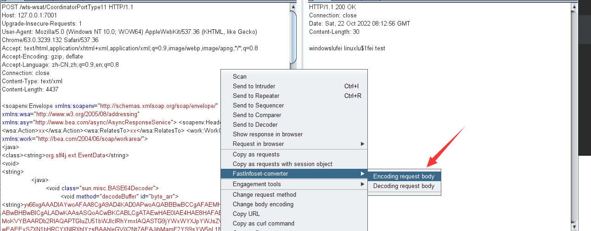
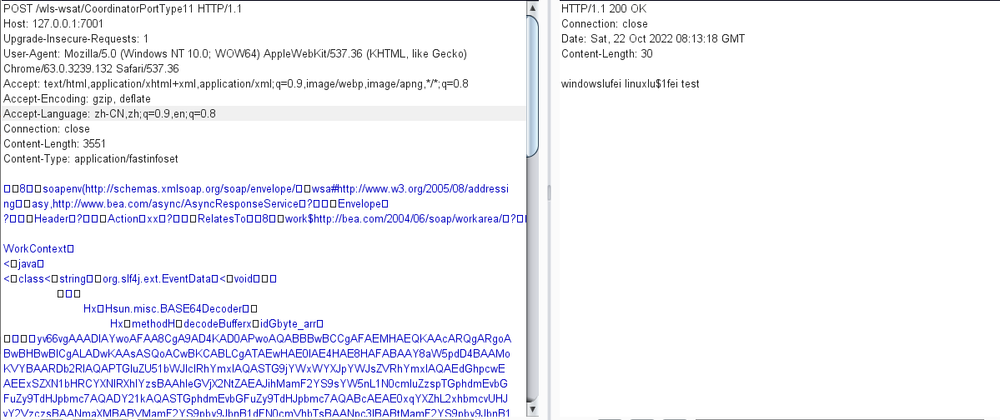

# FastInfoset conversion

>想法是在bp上进行转换xml格式的内容

encode:-> 将text/xml;charset=UTF-8换成application/fastinfoset

decode:-> 将application/fastinfoset换成text/xml;charset=UTF-8
## webLogic bypass

并且application/fastinfoset支持大小写

## 参考

https://github.com/AonCyberLabs/FastInfoset-Burp-Plugin

https://github.com/c0ny1/chunked-coding-converter